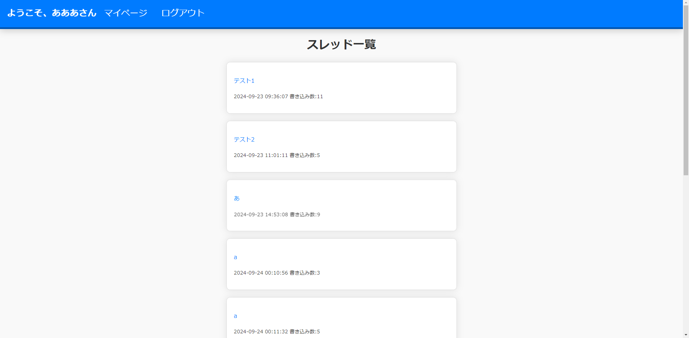
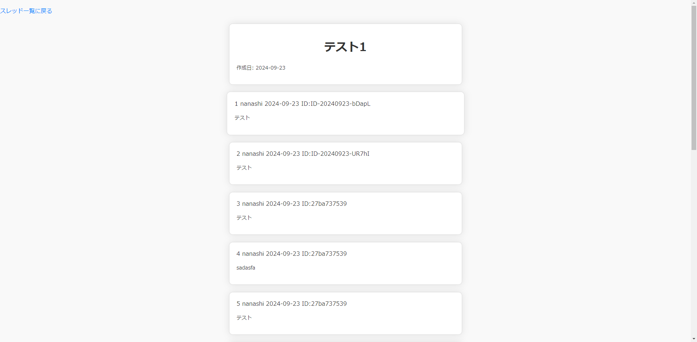
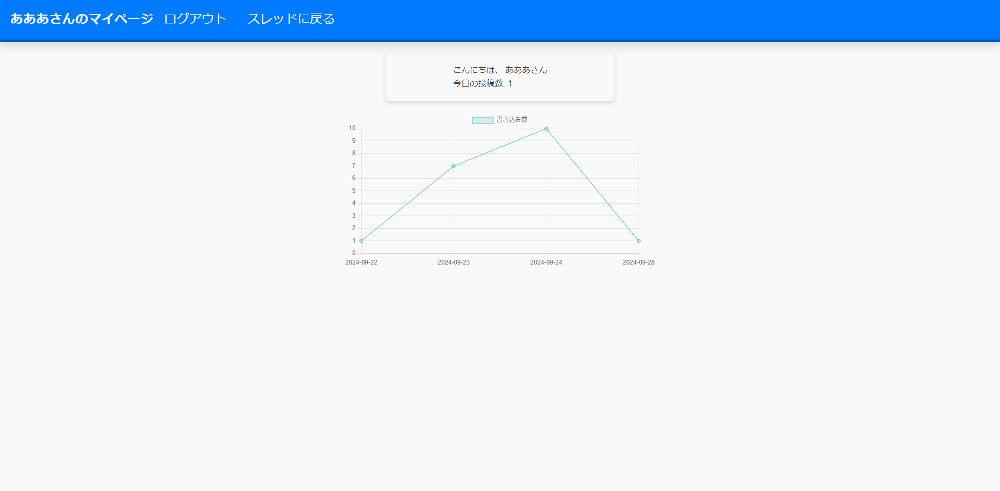

# BULLETIN-BOARD

## 概要

このプロジェクトは、ユーザーがメッセージを投稿できる掲示板アプリケーションです。

ユーザーがメッセージを投稿し、他のユーザーとコミュニケーションを取ることができます。以下は、アプリケーションの主な機能です。

## 詳細
- **ユーザー登録とログイン**:
  - 新規ユーザーの登録機能。
  - 既存ユーザーのログイン機能。
  - マイページでの、自身の書き込み数の記録とグラフ表示機能。

認証機能にはLaravelの組み込み認証機能Breezeを使用しています。

- **掲示板**:
  - ユーザーがスレッドに書き込む機能。
  - 名前欄など、掲示板の基本機能。
  - スレッドへの書き込みが1000を超えると削除される機能。
  - スレッドが保持数を超過すると削除される機能。

- **管理者機能**
  - 管理者画面のログイン時、登録されているメールアドレス宛にワンタイムパスワードが送られてくる機能。
  - スレッドの保持数を変更する機能。

以下は、アプリケーションのスクリーンショットです。

### トップページ
トップページではスレッドを一覧表示します。各ブロックにはスレッドのタイトルと書き込み数、作成日時が表示されます。


### 各スレッドページ
日付・投稿者名・IDを含んだ書き込みが一覧表示されます。
デフォルト名は「nanashi」となっていますが、ログインするとユーザー名が自動的に入力されています。
「nanashi」の場合も個人を識別できるよう、IDをつけています。IDは日によって変わります。


### マイページ
自身の書き込み数を日毎にグラフで表示しています。Chart.jsを利用しています。
書き込み数が300件未満の場合は「新米」、300件以上の場合は「ベテラン」、1000件以上の場合は「中堅」、5000件以上の場合は「達人」、10000件以上の場合は「マスター」というように、ランクが与えられます。


## セットアップ

### 1. リポジトリをクローン
まず、GitHubからプロジェクトをクローンします。

```bash
git clone https://github.com/monorail103/bulletin-board.git
cd bulletin-board
```

### 2. 依存関係をインストール
次に、Composerとnpmを使用して依存関係をインストールします。

```bash
composer install
npm install
```

### 3. 環境変数を設定
`.env.example`ファイルをコピーして`.env`ファイルを作成します。

```bash
cp .env.example .env
```

`.env`ファイルを編集します。
管理者画面のパスワードに必要な`MAIL_MAILER`はLogにしてください。なお実際のSMTPサーバーを使用する場合は適宜変更してください。
`DB_DATABASE`はbulletin_boardです。

```env
MAIL_MAILER =log

DB_DATABASE=bulletin_board
```

### 4. アプリケーションキーを生成
Laravelのアプリケーションキーを生成します。

```bash
php artisan key:generate
```

### 5. データベースのマイグレーション
データベースのテーブルを作成するために、マイグレーションを実行します。

```bash
php artisan migrate
```

### 6. データベースのシーディング（必要に応じて）
初期データをデータベースに挿入するために、シーディングを実行します。

```bash
php artisan db:seed
```

### 7. スタティックファイルのビルド
フロントエンドのアセットをビルドします。

```bash
npm run dev
```

### 8. サーバーを起動
ローカル開発サーバーを起動します。

```bash
php artisan serve
```

これで、ブラウザで`http://localhost:8000/threads`にアクセスして、掲示板が動作していることを確認できます。

## License

The Laravel framework is open-sourced software licensed under the [MIT license](https://opensource.org/licenses/MIT).
